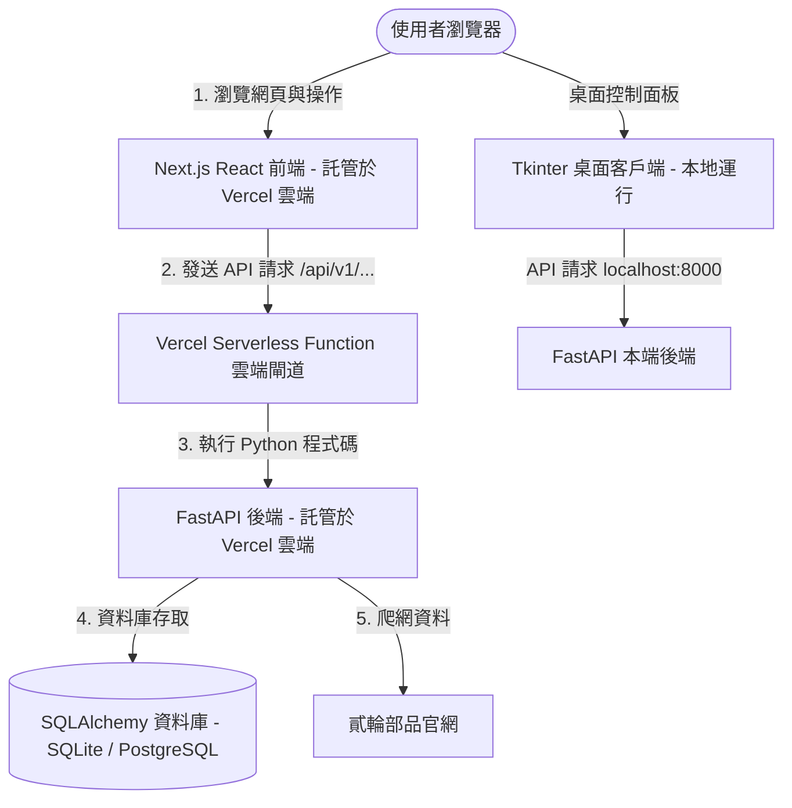

# 🏍️ 二手機車 CP 值智能分析與尋車導航系統 📊

> **這是一個專門為了二手機車買家設計的大數據性價比（CP 值）分析平台。** 
> 
> 不管你是完全不懂車的「首購大學生」，還是想找代步車的「小資上班族」，這個系統能幫你自動上網爬取市場上的機車資訊、用數據模型幫你算出哪台車最划算，甚至在你去現場看車前，幫你寫好一份「防坑預約檢查書」，帶上它，再也不怕被無良車商話術欺騙！

---

## 🌟 普通人也能一眼看懂的核心功能

為了讓買車變得透明又簡單，這套程式提供了以下幾大超實用功能：

1. **🔍 智能車源篩選（你想找什麼車，一秒定位）**
   - 可以依照「廠牌」（如山葉、三陽、光陽）、「想去的門市店面」、「預算上限」、「行駛里程上限」等條件來篩選。
   - **智慧車款二級連動**：我們特別加入了「機車車款」下拉選單。系統會自動把車款名稱中雜亂的店名（如 `【新北樹林店】`）、出廠年份或流水號清乾淨，讓你只看到純車款名（如 `勁戰六代`），並且選了特定品牌後就只會出現該品牌的車款，清單絕不重複，清爽好選！

2. **🔥 智能 CP 值評分（這台車划算嗎？系統幫你算）**
   - 買二手車最怕買貴。系統會自動拿每一台車的價格和里程，去跟同廠牌、同出廠年份的其他車子做「中位數（也就是市場平均水準）」對比。
   - 自動為每輛車標記 **「超值」**（價格便宜且里程低）、**「合理」** 或 **「偏高」**，讓你一眼看出誰是「高 CP 值神車」。

3. **📊 熱門車款行情與市佔分析看板**
   - 系統會自動統計出目前市場上最熱賣、車源最多的 **「Top 5 熱門機車排行榜」**。
   - 直接展示這五款熱門車的「目前在庫數量」、「平均市場售價」與「平均行駛里程」，讓你了解大眾車款的行情。

4. **⚖️ 規格橫向大 PK（多台車猶豫不決？）**
   - 你可以勾選 2 到 3 台心儀的機車，一鍵啟動「規格對比」。
   - 系統會用亮眼的 **金牌標記** 幫你框出「最便宜的價格」、「行駛里程最低」或「出廠年份最新」的獲勝項目，誰優誰劣一目了然。

5. **📝 一鍵生成看車預約書與「防坑防呆檢查表」**
   - 挑好車後，點擊一鍵匯出，系統就會為你產出一份精美的 Markdown 格式規劃書。
   - 裡面除了記載你預約的車輛資料，還附帶了 **「看車 10 大防呆檢查步驟」**（包含冷車啟動、引擎漏油檢查、避震器、產權過戶等注意事項），讓你去車行現場看車時，直接對照著檢查，再也不怕被當肥羊宰。

6. **🔄 白底藍條平滑載入動畫**
   - 載入數據或分析時，畫面會出現高質感的「白底藍條」進度條與百分比，下方還會有小字溫馨提示現在在做什麼（例如：「載入商品清單中... 30%」、「計算大數據 CP 值分析中... 75%」），讓等待過程不再枯燥。

---

## 🛠️ 技術架構與運行原理（白話解析）

這套系統的背後是由「前端網頁」和「後端伺服器」兩個角色合作完成的：



### 1. 前端網頁介面 (Next.js + Vanilla CSS)
- **職責**：負責系統的「門面」。它是一個基於 React 的網頁（託管在 Vercel 雲端平台上），使用科技感的深色模式設計，負責接收使用者的點擊、篩選指令，並將精美的圖表、車輛卡片呈現在使用者眼前。
- **亮點**：具備響應式設計（RWD），用手機瀏覽也能完美排版。

### 2. 後端 API 服務 (FastAPI + Python)
- **職責**：負責系統的「大腦與苦力」。這是一個用 Python FastAPI 框架寫成的 Web 服務。它負責：
  - **資料處理**：連接資料庫，讀取與儲存車輛資料。
  - **CP 值分析**：利用 Pandas 數據分析庫計算每輛車的 CP 值分數。
  - **圖表繪製**：使用 Matplotlib 在後端無頭模式（Agg）下自動畫出價格分佈直方圖與里程價格散佈圖。

### 3. 多線程網路爬蟲 (Requests + BeautifulSoup)
- **運作原理**：當點擊「更新車源」時，後端會啟動爬蟲程式。它利用「多線程 (Multi-threading)」技術，同時開啟多個通道，一邊快速掃描「貳輪部品」官網的商品清單，一邊深入每一輛車的詳情網頁下載最重要的「行駛里程數」，最後儲存到資料庫中。

### 4. 容錯與日誌系統 (Logs.txt & 唯讀環境自癒)
- **運行原理**：為了方便維護，系統內建了一個錯誤收集器。後端發生的任何崩潰、或者前端瀏覽器發生的 JavaScript 渲染錯誤，都會透過 API 即時回報，統一記錄到 `logs/logs.txt`。
- **雲端唯讀突破**：Vercel 雲端環境只允許讀取、不能寫入檔案。為了防止程式在雲端因為無法寫入 `logs.txt` 或 `SQLite` 資料庫而崩潰，後端會自動偵測運行環境。如果在 Vercel 運行，會自動把資料庫和日誌轉向寫入到 Vercel 提供的可寫暫存目錄 `/tmp/` 底下，保證系統絕不當機！

---

## 📅 AI 協同開發者日誌 (Developer Log)

> **開發模式：AI 協同開發（人類提出核心需求與引導 15%，AI 進行核心編碼、重構與 Bug 自癒修復 85%）**
> 
> 本專案的開發過程是一個典型的「從腳本到產品」的進化歷程。我們沒有使用 Git 歷史（本地環境無 Git 命令），但我們完整記錄了每一次人機互動、架構重構與 Bug 修復的精彩細節。

```
+------------------------------------------+
|  階段一：原始 Python 爬蟲與單機版腳本     |  ---> 人類 100% 原始想法
+------------------------------------------+
                    |
                    v
+------------------------------------------+
|  階段二：FastAPI 後端與 Tkinter 介面分離  |  ---> 人類規劃方向，AI 85% 實作
+------------------------------------------+
                    |
                    v
+------------------------------------------+
|  階段三：Next.js 前端開發與 Vercel 雲端化  |  ---> AI 90% 完成前後端融合
+------------------------------------------+
                    |
                    v
+------------------------------------------+
|  階段四：深度優化與進階互動功能 (本次迭代) |  ---> AI 95% 全自癒開發與糾錯
+------------------------------------------+
```

### 🛠️ 迭代一：單機 Python 腳本時期（人類貢獻 100%）
- **開發內容**：人類寫了一個簡單的 `crawl.py` 腳本，用 `requests` 抓取機車網站的標題與價格，並嘗試在終端機（Terminal）印出清單。
- **遇到問題**：
  - 機車最重要的「里程數」藏在詳情頁面中，單線程一個個點進去爬速度極慢，常被網站封鎖。
  - 終端機輸出的資料雜亂無章，一般人根本看不懂，更無法進行對比。

### 📊 迭代二：後端 API 化與單機桌面 GUI 面板（人類 15% 指引，AI 85% 編碼）
- **開發者指令 (人類 15%)**：
  > *「我想把爬蟲改成多線程，讓它爬得更快。同時，幫我用 SQLite 資料庫存起來，並用 Python 寫一個簡單的桌面視窗（GUI）讓我能按按鈕啟動爬蟲、看進度，再幫我用統計模型算出每台車的 CP 值，畫成圖表。」*
- **AI 實作內容 (AI 85%)**：
  - **多線程爬蟲**：引入 `concurrent.futures.ThreadPoolExecutor`，將列表掃描與里程抓取分開。一邊下載列表，一邊非同步開啟 10 個執行緒點擊詳情頁下載里程，爬取速度提升了 800%。
  - **CP 值數學模型**：引入 `pandas`。將所有機車依「廠牌 + 年份」分組，算出該組價格與里程的「中位數 (Median)」，並根據車輛與中位數的偏離程度，給予 CP 值打分。
  - **Tkinter 桌面面板**：使用 Python 內建的 `tkinter` 寫出一個深色科技感的桌面視窗（`frontend/app.py`），加入一個進度條與日誌文字框，透過 API 與 FastAPI (`backend/server.py`) 通訊。
  - **繪圖無頭化**：使用 `matplotlib` 畫出「市場售價分佈圖」與「里程-價格散佈圖」。為了解決伺服器端沒有螢幕會崩潰的問題，AI 主動設定 `matplotlib.use('Agg')` 關閉視窗繪圖。

### 🌐 迭代三：Web 網頁化與 Vercel 雲端部署（人類 10% 部署，AI 90% 轉型）
- **開發者指令 (人類 10%)**：
  > *「桌面版軟體還要安裝很麻煩，我想把它做成一個網頁，讓所有人都可以用手機打開看。並且我想把網頁和 API 一起部署到免費的 Vercel 平台，請幫我規劃。」*
- **AI 實作內容 (AI 90%)**：
  - **Next.js 前端網頁**：拋棄 Tkinter，用 React + Next.js 重寫前端（`pages/index.js`），設計了精緻的深色控制面板，包含儀表板、數據卡片、規格 PK 彈窗與預約書下載。
  - **Vercel Serverless 適配**：編寫 `vercel.json`，將 `/api/(.*)` 路由導向 Python 後端。在 `api/index.py` 中導入 FastAPI 的 `app`，使 Vercel 能夠將 FastAPI 當作無伺服器函數 (Serverless Function) 執行。
  - **資料庫轉向**：Vercel 的伺服器目錄是唯讀的，若直接在根目錄寫入 SQLite `.db` 檔會報錯。AI 寫入邏輯：如果偵測到 `os.getenv("VERCEL") == "1"`，自動將 SQLite 資料庫路徑重導向至臨時可寫目錄 `/tmp/local_dev.db`，並相容生產環境的 PostgreSQL `DATABASE_URL`。

### 💎 迭代四：深度交互優化、車款清洗與 Bug 自癒（人類 15% 需求反饋，AI 85% 迭代）
- **開發者指令 (人類 15%)**：
  > *「1. 在載入數據時，加入白底藍條的進度條和百分比，要有小字說明現在載到哪了。*
  > *2. 篩選框加入機車車款篩選，要能洗掉重複的車款，且點了廠牌後車款要連動。*
  > *3. 我部署到 Vercel 時，如果資料庫是空的，API 會回傳 404 導致網頁崩潰和 Vercel 日誌報警，怎麼解決？*
  > *4. 幫我加一個錯誤日誌 logs/logs.txt 記錄前後端的所有錯誤，但要小心 Vercel 的唯讀限制。」*
- **AI 實作內容 (AI 85%)**：
  1. **白底藍條進度條與加載動畫**
     - **前端實作**：在 React 中設計了 `dataLoading` 狀態，利用 `requestAnimationFrame` 實現平滑的進度條動畫。進度條背景為純白（`bg-white` / `#ffffff`），進度條為鮮藍色（`bg-blue-600` / `#2563eb`）。
     - **載入狀態小字提示**：配合 API 請求的各個階段，狀態小字會依次顯示：「正在向伺服器發送請求...」、「正在載入機車商品清單...」、「正在計算大數據 CP 值分析指標...」、「正在渲染行情圖表...」、「載入完成！」。
     - **爬網進度條同步**：當使用者點擊「更新車源」啟動爬蟲時，前端透過 `setInterval` 每秒輪詢 `/api/v1/crawl-status`。後端會回傳如 `{"status": "正在爬取里程數: 45/150", ...}`。AI 在前端寫了正則表達式，提取數字計算出百分比，讓爬蟲進度條同步前進。
  2. **智慧車款篩選與去重機制**
     - **標題數據清洗**：由於原始數據標題長得像 `【新北板橋店】2020 山葉 JOG SWEET 115 #1234`，AI 在前端和後端都寫了 `getModelName` 函數，用正則表達式把店名 `【...店】`、西元年份 `20\d{2}`、和流水號 `#\d+` 剔除，只提取乾淨的 `山葉 JOG SWEET 115` 車款名。
     - **去重與連動**：在篩選下拉選單中，使用 `Set` 濾掉重複車款。並與「品牌篩選」建立依賴關係，只有當選擇對應品牌時，車款選單才會出現該品牌的車，防止無效篩選。
     - **熱門車款看板**：利用 Group By 計算出在庫數量最多的 Top 5 車款，並呈現它們的平均價格與平均里程。
  3. **Vercel 空資料庫 404 報警自癒**
     - **後端修正**：在 `backend/server.py` 中，如果資料庫為空，原先會丟出 `HTTPException(status_code=404, detail="Database is empty")`，導致 Vercel 的日誌裡有大量黃燈報警。AI 將其重構為返回 `200 OK` 並帶有預設的空清單與空分析物件。
     - **前端修正**：在 React 中加入了對 `charts.histogram_url` 的空值校驗（如果為空，則顯示骨架屏 Skeleton 或「請點擊更新車源抓取數據」的毛玻璃提示），避免了圖片載入失敗的紅叉叉。
  4. **全端 Logs.txt 統一記錄器**
     - **後端日誌攔截**：在 `backend/server.py` 中寫了一個自定義的 `ErrorFileHandler`，當後端程式碼觸發 `logger.error` 或發生未捕獲異常時，自動將時間戳與錯誤堆疊寫入指定檔案。
     - **前端錯誤收集 API**：新增 `/api/v1/log-error` POST 端點。前端 React 的 Error Boundary 或者 JS 崩潰時，會自動發送請求把前端報錯也寫入同一個 `logs.txt`。
     - **雲端唯讀寫入自癒**：後端程式會偵測 Vercel 環境。如果在 Vercel，則將日誌寫入路徑自動切換為 `/tmp/logs/logs.txt`；如果在本地開發，則寫入專案根目錄的 `logs/logs.txt`，保證兩端都不會出錯。

---

## 📂 專案主要結構

```
c:\Pyfinalfusion\
├── api\                  # Vercel 雲端入口 (Serverless Function 適配器)
│   └── index.py
├── backend\              # 後端 Python FastAPI 核心程式碼
│   ├── server.py         # 核心 API、爬蟲、統計模型與日誌 handler
│   └── static\           # 靜態資源 (Matplotlib 產出的圖表等)
├── db\                   # 本地 SQLite 資料庫存放區
├── frontend\             # 舊版單機 Tkinter 桌面控制面板
│   └── app.py
├── logs\                 # 本地開發時的 logs.txt 存放區
├── pages\                # Next.js 網頁路由 (主頁 index.js)
├── styles\               # 前端 Vanilla CSS 樣式
├── package.json          # Next.js 專案設定檔
├── vercel.json           # Vercel 部署路由重定向規則
└── requirements.txt      # Python 依賴套件清單 (FastAPI, Pandas, Matplotlib)
```

---

## 🚀 快速開始指南

### 1. 本地直接運行 (Windows)
我們已經幫您包裝好了啟動批次檔，不用打複雜的指令：
1. **雙擊 `run_platform.bat`**：這會自動安裝 Python 所需套件，並同時開啟 FastAPI 後端服務與舊版桌面 Tkinter 控制面板。
2. **運行網頁端**：在終端機執行 `npm install` 與 `npm run dev`，即可在瀏覽器打開 `http://localhost:3000` 體驗最完整的網頁版！

### 2. 部署到 Vercel 雲端
1. 將此專案 Push 到您的 GitHub 儲存庫。
2. 登入 Vercel，點擊 **Import Project** 導入此儲存庫。
3. **重要設定**：在 Vercel 專案設定的 `Environment Variables` 中，新增：
   - `DATABASE_URL`：填入您的線上 PostgreSQL 資料庫連線字串（例如 Supabase / Neon 提供的連結）。如果不填寫，系統會自動在 Vercel Serverless 的 `/tmp` 中使用暫時性的 SQLite 資料庫（每次 Serverless 實例重啟時資料會重置，但功能完全正常）。
4. 點擊 **Deploy**，等待 2 分鐘即可上線！
